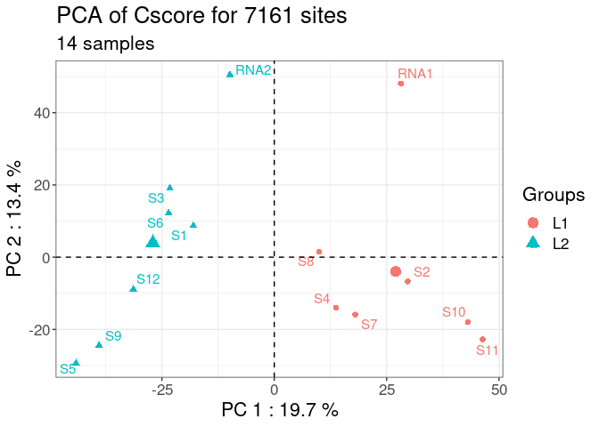
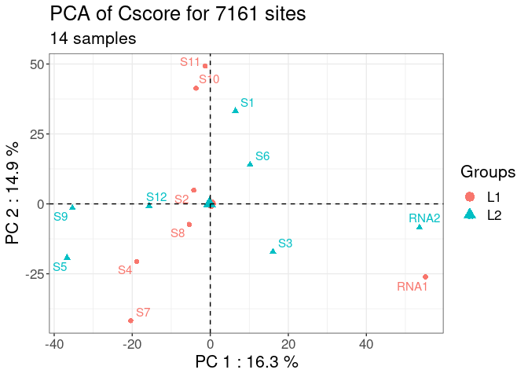
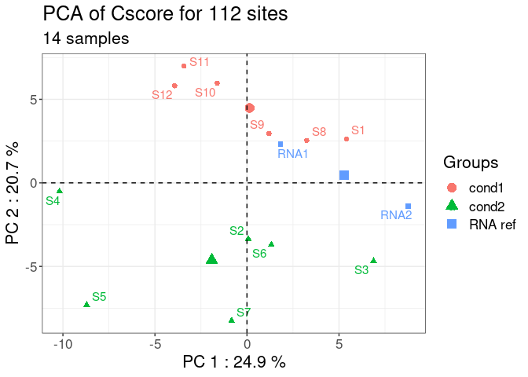
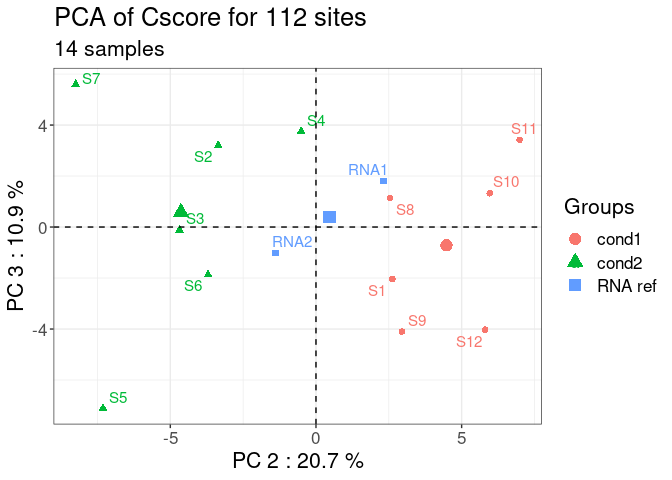

<!-- README.md is generated from README.Rmd. Please edit that file -->

# rRMSAnalyzer: package to analyze RiboMethSeq data


- [Installation](#installation)
- [Usage](#usage)
- [Help, bug reports and suggestions](#help--bug-reports-and-suggestions)
- [Acknowledgements](#acknowledgements)
- [Funding](#funding)
- [Data](#data)
  * [RiboClass](#riboclass)
  * [Loading data](#loading-data)
  * [Data](#data-1)
  * [Metadata](#metadata)
  * [RNA names](#rna-names)
- [C-score calculation](#c-score-calculation)
  * [What is C-score](#what-is-c-score)
  * [C-score computation when loading data](#c-score-computation-when-loading-data)
  * [C-score computation during the analysis process](#c-score-computation-during-the-analysis-process)
- [Quality control](#quality-control)
  * [Identification of batch effect](#identification-of-batch-effect)
  * [Batch effect adjustment](#batch-effect-adjustment)
- [Sample manipulation](#sample-manipulation)
  * [Keep or remove samples](#keep-or-remove-samples)
- [RNA annotation](#rna-annotation)
  * [RNA manipulation](#rna-manipulation)
    + [Remove RNA](#remove-rna)
    + [Rename RNA](#rename-rna)
  * [Annotation of RNA 2’Ome sites](#annotation-of-rna-2-ome-sites)
    + [Annotation included: Human 2’Ome rRNA sites](#annotation-included--human-2-ome-rrna-sites)
    + [Customize 2’Ome sites annotations](#customize-2-ome-sites-annotations)
  * [Annotate RNA sites](#annotate-rna-sites)
- [Data visualization with PCA](#data-visualization-with-pca)
- [Export data](#export-data)
  * [Export as a dataframe](#export-as-a-dataframe)
  * [Export as a ggplot-ready dataframe](#export-as-a-ggplot-ready-dataframe)
  * [Export as a dataframe by condition](#export-as-a-dataframe-by-condition)


## Installation

The latest version of rRMSAnalyzer package can be installed from Github
with :

``` r
library(devtools)
devtools::install_github("EPIRNAtools/rRMSAnalyzer")
```

## Usage

``` r
library(rRMSAnalyzer)

ribo <- load_ribodata(
              count_path = "/path/to/your/csvfiles/directory/",
              metadata = "path/to/metadata.csv",
              metadata_key = "filename",
              metadata_id = "samplename")

# Compute the c-score using different parameters,
# including calculation of the local coverage using the mean instead of the median
ribo <- compute_cscore(ribo, method = "mean")

# If necessary, adjust any technical biases using ComBat-Seq.
# Here, as an example, we use the "library" column in metadata.
ribo <- adjust_bias(ribo,"library")

# Plot a Principal Component Analysis (PCA) whose colors depend on the "condition" column in metadata
plot_PCA(ribo,"condition")
```

## Help, bug reports and suggestions

To report a bug or any suggestion to improve the package, please let us
known by opening a new issue on: *github issue link coming soon!*

## Acknowledgements

We would like to thank all our collaborators for their advices and
suggestions.

## Funding

This project has been funded by the French Cancer Institute (INCa, PLBIO
2019-138 MARACAS), the SIRIC Program (INCa-DGOS-Inserm_12563 LyRICAN)
and Synergie Lyon Cancer Foundation.

## Data

### RiboClass

RiboClass is the main class of the package that allows to store both the
data matrices (counts and c-scores) and the associated metadata. It is
automatically created when calling *load_ribodata* (see [Loading
data](#loading-data)).

It is a list containing three main elements, individually described
below:

1.  **Data**: a list of dataframe, containing for each sample the 5’
    and/or 3’ read-end counts provided by the user, and the calculated
    c-score.

2.  **Metadata**: a dataframe, containing all the information related to
    the samples that can be provided by the user.

3.  **RNA_names**: a dataframe, reporting the names of the RNA used in
    Data.

Some main function calls’ parameters (such as the normalization method
used for c-score computation) are also kept in the RiboClass object as a
reminder.

### Loading data

Here is an example, where all *load_ribodata* parameters are shown :

``` r
path <- system.file("extdata", package="rRMSAnalyzer")

ribo <- load_ribodata(
                      #data & metadata files path
                      count_path = paste0(path,"/miniglioma"),
                      metadata = paste0(path,"/metadata.csv"),
                      # data & metadata files separator
                      count_sep = "\t",
                      metadata_sep = ",",
                      # count data parameters :
                      count_header = FALSE,
                      count_value = 3,
                      count_rnaid = 1,
                      count_pos = 2,
                      # Metadata parameters :
                      metadata_key = "filename",
                      metadata_id = "samplename",
                      # c-score parameters :
                      flanking = 6,
                      method = "median",
                      ncores = 1)
#> [SUCCESS] Your data have been imported and the following RiboClass has been created :
#> a RiboClass with 14 samples and 4 RNA(s) :
#> Name : NR_023363.1_5S, length : 121
#>  Name : NR_046235.3_5.8S, length : 157
#>  Name : NR_046235.3_18S, length : 1869
#>  Name : NR_046235.3_28S, length : 5070
```

### Data

To use this package, the user should provide one csv file with the 5’,
3’ or 5’/3’ read end counts resulting from RiboMethSeq data per sample.
The folder structure containing the csv files is not important, as long
as either the directory and its sub-directories contain the necessary
csv files.

1.  The **name of the RNA** on which the read end counting has been
    performed.

2.  The **number of the position** on the RNA.

3.  The **value of the read end counts** at the position.

Here is an example :

| RNA | Position on RNA | read end count |
|-----|-----------------|----------------|
| 18S | 123             | 3746           |
| 18S | 124             | 345            |
| 18S | 125             | 324            |
| 18S | 126             | 789            |
| 18S | 127             | 1234           |

Note 1: it is not necessary to provide an header in the count files,
because column index can be used in the function *load_ribodata*, using
*count_value*, *count_rnaid* and *count_pos* parameters.

Note 2: if no metadata is specified, rRMSAnalyzer will try to fetch any
csv files in the folder specified in count_path and its subfolders.

### Metadata

<u>Two columns are mandatory for the metadata dataframe:</u>

1.  **filename**: name of the csv file on disk containing the read end
    counts described above. Do not modify it unless the filename has
    changed on disk.

2.  **samplename**: rename the samples, which will be analyzed and shown
    on the plots. This column could be modified, as long as the sample
    names are unique.

Following these two mandatory columns, provide as many columns as needed
for the analysis.

Here is an example of metadata for three samples:

<table style="width:74%;">
<colgroup>
<col style="width: 20%" />
<col style="width: 20%" />
<col style="width: 31%" />
</colgroup>
<thead>
<tr class="header">
<th><p>filename</p>
<p>(mandatory)</p></th>
<th><p>samplename</p>
<p>(mandatory)</p></th>
<th><p>biological condition</p>
<p>(optionnal)</p></th>
</tr>
</thead>
<tbody>
<tr class="odd">
<td>sample1.csv</td>
<td>sample 1</td>
<td>condition 1</td>
</tr>
<tr class="even">
<td>sample2.csv</td>
<td>sample 2</td>
<td>condition 1</td>
</tr>
<tr class="odd">
<td>sample3.csv</td>
<td>sample 3</td>
<td>condition 2</td>
</tr>
</tbody>
</table>

Note: if no metadata are provided in load_ribodata, an empty metadata
will be created with pre-completed “filename” and “samplename” columns.
The “samplename” column will be identical to “filename”, but can be
modified by the user.

Here is an example of auto-generated metadata:

| filename    | samplename  |
|-------------|-------------|
| sample1.csv | sample1.csv |
| sample2.csv | sample2.csv |
| sample3.csv | sample3.csv |

### RNA names

RNA names are stored in an auto-generated dataframe when loading data.
It contains two columns :

1.  **original_name**: original name of each RNA (e.g NR_023363.1).

2.  **current_name**: current name of each RNA, reflecting any user’s
    change with *rename_rna* function (see [Rename RNA](#rename-rna)).

This dataframe is used to keep track of the original name, which often
contains NCBI’s accession ID.

Here is an example:

| original_name    | current_name |
|------------------|--------------|
| NR_023363.1_5S   | 5S           |
| NR_046235.3_5.8S | 5.8S         |
| NR_046235.3_18S  | 18S          |
| NR_046235.3_28S  | 28S          |

## C-score calculation

### What is C-score

The C-score corresponds to the 2’Ome level at a RNA position. The
C-score represents a drop in the end read coverage at a given position
compared to the environmental coverage, as described by @birkedal2014.
The C-score can be of 0 (i.e., no RNA molecule is 2’Ome at the position
of interest), of 1 (i.e., all the RNA molecules are 2’Ome at the
position of interest) and of \]0:1\[ (i.e., a mix of un-methylated and
methylated RNA molecules).

Different C-scores can be determined to obtain robust estimation of
2’Ome level depending on the parameters used to compute the local
coverage. In particular, the computation method and the size of the
local coverage can be changed.

By default, the computation method of the local coverage corresponds to
the **median** and the size of the local coverage corresponds to a
**flanking region of** **6** (i.e., 6 nucleotides downstream the
nucleotide n and 6 upstream the nucleotide n). This package offers the
possibility to change these two parameters either when loading the data
or during the analysis process.

### C-score computation when loading data

When the function *load_ribodata* is used, a C-score is automatically
computed for all genomic positions of the RNA. The C-score is computed
using either the default parameters of the *load_ribodata* function or
the user’s parameters as followed:

``` r
load_ribodata(count.path = "/path/to/csv/",
              metadata = "/path/to/metadata.csv",
              # everything below is linked to c-score computation
              flanking = 6, # flanking region size
              method = "median", # use mean or median on flanking region's values
              ncores = 8 # number of CPU cores to use for computation
              )
```

### C-score computation during the analysis process

During the analysis, the parameters to compute the C-score can be
modified using the compute_cscore function, which will automatically
update the C-score in the RiboClass.

In the following example, both the flanking region’s size of the local
coverage and the computation method have been modified:

``` r
ribo <- compute_cscore(ribo,
                       flanking = 4,
                       method = "mean")
```

Note: this function will override the previous c-score of the RiboClass.

## Quality control

### Identification of batch effect

Technical bias (i.e., batch effect) can be identified by plotting
C-scores at all the genomic positions of the RNA for each sample on a
PCA (see also \[Visualization with PCA\] for more usages).

Here is an example:

``` r
plot_PCA(ribo = ribo,
         color_col = "run")
```

<!-- -->

In this example, the technical replicates RNA1 and RNA2 included in
library 1 and 2 respectively, are distant from each other on the PC1
axis. Moreover, the samples should not be grouped by library or batch.
The following section will resolve this batch effect.

### Batch effect adjustment

Batch effect of RiboMethSeq data can be adjusted using the ComBat-seq
method (Paraqindes et al, in preparation; @zhang2020) . The rRMSAnalyzer
package includes a wrapper (adjust_bias) to perform ComBat-seq
adjustment that will return a new RiboClass with adjusted read end count
values and C-scores automatically recomputed with the same setup
parameters.

``` r
ribo_adjusted <- adjust_bias(ribo, batch = "run")
#> Found 2 batches
#> Using null model in ComBat-seq.
#> Adjusting for 0 covariate(s) or covariate level(s)
#> Estimating dispersions
#> Fitting the GLM model
#> Shrinkage off - using GLM estimates for parameters
#> Adjusting the data
#> Recomputing c-score with the following parameters :
#> - C-score method : median
#> - Flanking window : 6
```

Batch effect adjustment can be verified using the plot_PCA function
using the new RiboClass:

``` r
plot_PCA(ribo_adjusted,"run")
```

<!-- -->

After batch effect adjustment using ComBat-seq method, the two technical
replicates RNA1 and RNA2 show reduced dispersion, and the samples are
separated on the PCA axes independently of the library groups.

## Sample manipulation

### Keep or remove samples

A sample subset can be easily analyzed by indicating the samples to keep
or to remove. The user can thus create a new RiboClass object containing
the data and metadata of the samples of interest. In both cases, only
the remaining samples’ metadata are kept in the RiboClass object, so no
manual updating is required.

Here is an example to generate a new RiboClass by keeping two samples of
interest (“S1” and “S2”):

``` r
ribo_2samples <- keep_ribo_samples(ribo_adjusted,c("S1","S2"))
print(ribo_2samples)
#> a RiboClass with 2 samples and 4 RNA(s) :
#> Name : NR_023363.1_5S, length : 121
#>  Name : NR_046235.3_5.8S, length : 157
#>  Name : NR_046235.3_18S, length : 1869
#>  Name : NR_046235.3_28S, length : 5070
```

Here is an example to generate a new RiboClass by removing two samples
(“S1” and “S2”):

``` r
ribo_removed_samples <- remove_ribo_samples(ribo,c("S1","S1"))
print(ribo_removed_samples)
#> a RiboClass with 13 samples and 4 RNA(s) :
#> Name : NR_023363.1_5S, length : 121
#>  Name : NR_046235.3_5.8S, length : 157
#>  Name : NR_046235.3_18S, length : 1869
#>  Name : NR_046235.3_28S, length : 5070
```

In both cases, only the remaining samples’ metadata are kept in the
RiboClass object. You do not need to update it by hand.

## RNA annotation

### RNA manipulation

#### Remove RNA

A RNA subset can be easily analyzed by indicating the RNA to remove. The
user can thus create a new RiboClass object containing the data of the
RNAs of interest, without affecting the samples’ metadata.

Here is an example where the RNA 5S is removed:

``` r
ribo_adjusted <- remove_rna(ribo, rna_to_remove = "NR_023363.1_5S")
print(ribo_adjusted)
#> a RiboClass with 14 samples and 3 RNA(s) :
#> Name : NR_046235.3_5.8S, length : 157
#>  Name : NR_046235.3_18S, length : 1869
#>  Name : NR_046235.3_28S, length : 5070
```

#### Rename RNA

Annotation of rRNA 2’Ome sites using the lists provided by this package
requires the usage of specific RNA names.

Here is an example to check whether the RNA names provided by the user
in the RiboClass match the ones used by this package :

``` r
data("human_methylated")
cat("human_methylated's rna names: ", unique(human_methylated$rRNA),"\n")
#> human_methylated's rna names:  5.8S 18S 28S
cat("ribo's rna names: ", as.character(ribo_adjusted$rna_names$current_name))
#> ribo's rna names:  NR_046235.3_5.8S NR_046235.3_18S NR_046235.3_28S
```

In this example, the names are different and need to be updated before
annotation.

The function rename_rna updates automatically the rRNA names that are
given by rRNA size order:

``` r
ribo_adjusted <- rename_rna(ribo_adjusted,
                            new_names = c("5.8S", "18S", "28S")) 
                            # from the shortest RNA in our RiboClass to the longest.
```

### Annotation of RNA 2’Ome sites

This package computes a C-score for each genomic position of the RNAs.
The C-scores of the RNA 2’Ome sites of interest are then extracted using
a list of annotated sites and the annotate function.

#### Annotation included: Human 2’Ome rRNA sites

By default, this package includes two dataframes including the positions
and the annotations of the human rRNA 2’Ome sites:

- human_methylated: a dataframe, containing the 112 known 2’Ome sites
  for the human rRNAs.

- human_suspected: a dataframe, containing the 17 sites that are
  putative 2’Ome sites for the human rRNAs, as described in the
  litterature.

#### Customize 2’Ome sites annotations

Instead of using the list of human rRNA 2’Ome sites included with this
package, the user can provide its own list and annotation using the
function annotate_site.

A dataframe with three mandatory columns should be provided :

- **RNA name**: the name of the RNA, matching the RNA name of the
  RiboClass.

- **Position on RNA**: the number of the position on the RNA.

- **Nomenclature**: the name given to the site of interest.

You can see an example below :

| Position | rRNA | Nomenclature |
|----------|------|--------------|
| 15       | 5.8S | Um14         |
| 76       | 5.8S | Gm75         |
| 28       | 18S  | Am27         |

### Annotate RNA sites

The 2’Ome sites of interest can be annotated using the annotate function
with either the provided annotations or customized ones.

Here is an example with the provided human methylated annotations:

``` r
ribo_adjusted <- annotate_site(ribo_adjusted,
                               annot = human_methylated,
                               anno_rna = "rRNA",
                               anno_pos = "Position",
                               anno_value = "Nomenclature")
```

Note: if an issue occurs during the annotation process, the user should
check the [Rename RNA](#rename-rna) section.

This vignette has also some explanations on how to create your own sites
annotation dataset with [Customize 2’Ome sites
annotations](#customize-2ome-sites-annotations).

## Data visualization with PCA

The function plot_PCA, which returns a ggplot, has been implemented with
several parameters for more flexibility:

1.  **only_annotated**: plot samples based on the annotated RNA 2’Ome
    sites only to determine whether samples clustered depending on their
    rRNA 2’Ome profile.

Here is an example comparing samples reflecting different biological
conditions based on the rRNA 2’Ome profile of the provided
human_methylated list:

``` r
plot_PCA(ribo_adjusted,
         color_col = "condition",
         only_annotated = TRUE)
```

<!-- -->

2.  **axes**: by default, PC1 and PC2 axes are plotted. However, the
    user can choose the PCA axes of interest using the “axes” parameter.

``` r
plot_PCA(ribo_adjusted,
         color_col = "condition",
         axes = c(2,3), #PC2 and PC3 will be plotted
         only_annotated = TRUE)
```

<!-- -->

3.  **pca_object_only**: return the full dudi.pca object by setting
    pca_object_only to True:

``` r
pca <- plot_PCA(ribo_adjusted,
         color_col = "condition",
         only_annotated = TRUE,
         pca_object_only = TRUE)
```

## Export data

Data can be exported as two different objects.

### Export as a dataframe

The user can export data as a dataframe using the function extract_data.

By default, it will export c-score for all the genomic RNA positions.

``` r
ribo_df <- extract_data(ribo_adjusted,
                        col = "cscore")
```

The user can export data related to the subset of annotated RNA 2’Ome
sites by setting the *only_annotated* parameter to True.

``` r
ribo_df <- extract_data(ribo_adjusted,
                        col = "cscore",
                        only_annotated = TRUE)
```

| site      |        S1 |        S2 |        S3 |
|:----------|----------:|----------:|----------:|
| 18S_Am27  | 0.9783333 | 0.9745514 | 0.9810412 |
| 18S_Am99  | 0.9680204 | 0.9646470 | 0.9724150 |
| 18S_Um116 | 0.9276274 | 0.9470968 | 0.9407083 |
| 18S_Um121 | 0.9630216 | 0.9684459 | 0.9691576 |
| 18S_Am159 | 0.9629730 | 0.9620986 | 0.9686766 |
| 18S_Am166 | 0.9809492 | 0.9744627 | 0.9744998 |
| 18S_Um172 | 0.9510189 | 0.9400922 | 0.9517981 |
| 18S_Cm174 | 0.9119119 | 0.8668456 | 0.8806886 |
| 18S_Um354 | 0.9709273 | 0.9722054 | 0.9756174 |
| 18S_Um428 | 0.9268668 | 0.9276018 | 0.9504224 |

excerpt from the output dataframe. S1, S2 and S3 are samples.

### Export as a ggplot-ready dataframe

The user can export data as a ggplot-ready dataframe using the function
format_to_plot.

By default, it will export c-score for all the genomic RNA positions.
The user can export additional information present in the metadata by
indicating the name of the column of interest. The user can export
information related to the subset of annotated RNA 2’Ome sites by
setting the only_annotated parameter to True.

Here is an example of ggplot-ready dataframe including the C-scores of
all the genomic RNA positions as well as the condition related to the
particular sample of interest:

``` r
ggplot_table <- format_to_plot(ribo_adjusted,"condition")
```

|     | sampleID | Cscore             | condition |
|:----|:---------|:-------------------|:----------|
| 501 | RNA1     | 0                  | RNA ref   |
| 502 | RNA1     | 0.282380396732789  | RNA ref   |
| 503 | RNA1     | 0.110590988882387  | RNA ref   |
| 504 | RNA1     | 0.615841584158416  | RNA ref   |
| 505 | RNA1     | 0                  | RNA ref   |
| 506 | RNA1     | 0                  | RNA ref   |
| 507 | RNA1     | 0                  | RNA ref   |
| 508 | RNA1     | 0.507692307692308  | RNA ref   |
| 509 | RNA1     | 0.118110236220472  | RNA ref   |
| 510 | RNA1     | 0.0637554585152839 | RNA ref   |

Excerpt from the output ggplot-ready dataframe

### Export as a dataframe by condition

The user can export a dataframe compiling the mean C-scores of each
position by specific conditions provided in the metadata dataframe using
the mean_samples_by_conditon function.

By default, it will export for all the genomic RNA positions the name of
the position, the mean and sd of the C-scores. The user can also export
mean and sd of read end count. The user can export information related
to the subset of annotated RNA 2’Ome sites by setting the only_annotated
parameter to True.

Here is an example of dataframe including the mean C-scores per
conditions for all the genomic RNA positions:

``` r
mean_tb <- mean_samples_by_conditon(ribo_adjusted,
                                    value = "cscore",
                                    metadata_condition = "condition",
                                    only_annotated = TRUE)
```

| site       | condition |      mean |        sd |
|:-----------|:----------|----------:|----------:|
| 18S_Am1031 | cond1     | 0.9703699 | 0.0032725 |
| 18S_Am1031 | cond2     | 0.9723714 | 0.0057723 |
| 18S_Am1031 | RNA ref   | 0.9749922 | 0.0047461 |
| 18S_Am1383 | cond1     | 0.9765212 | 0.0027083 |
| 18S_Am1383 | cond2     | 0.9779684 | 0.0028759 |
| 18S_Am1383 | RNA ref   | 0.9796876 | 0.0035939 |
| 18S_Am159  | cond1     | 0.9609920 | 0.0054882 |
| 18S_Am159  | cond2     | 0.9623362 | 0.0065239 |
| 18S_Am159  | RNA ref   | 0.9684126 | 0.0022025 |
| 18S_Am166  | cond1     | 0.9791230 | 0.0027282 |

Excerpt from the output dataframe by condition
